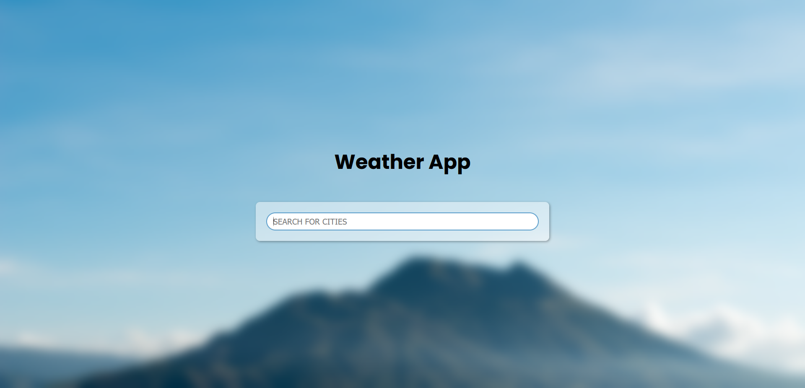

# Weather App

## built with Vanilla JavaScript uses APIs to fetch and display real-time weather data for a specific location. It focuses on simple, lightweight, and interactive functionality without relying on frameworks or libraries

